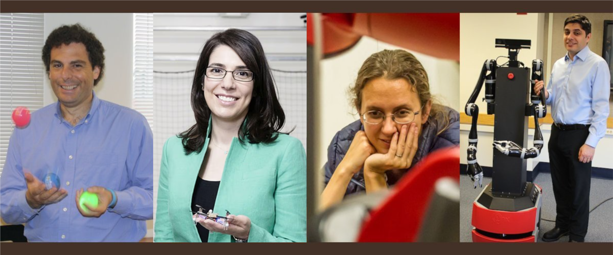

---
# Feel free to add content and custom Front Matter to this file.
# To modify the layout, see https://jekyllrb.com/docs/themes/#overriding-theme-defaults

permalink: /
title: Home
layout: all
---

Brown Robotics Talks consists of BigAI talks and lab talks (CIT 115). From spring 2024, this website is created to track both talk series. All confirmed schedule will be posted, together with recordings of past talks (you'll need a Brown account to access the recordings).

### Schedule for Spring 2024

<table>
<thead>
  <tr>
    <th>Date</th>
    <th>Talk</th>
    <th>Speaker</th>
  </tr>
</thead>
<tbody>
  <tr>
    <td>01/26</td>
    <td><b>TBD</b></td>
    <td>Glen Chou</td>
  </tr>
  <tr>
    <td>02/02</td>
    <td><b>Deep Reinforcement Learning for Multi-Agent Interaction</b></td>
    <td>Stefano V. Albrecht</td>
  </tr>
  <tr>
    <td>03/01</td>
    <td><b>TBD</b></td>
    <td>Felix Yanwei Wang</td>
  </tr>
</tbody>
</table>