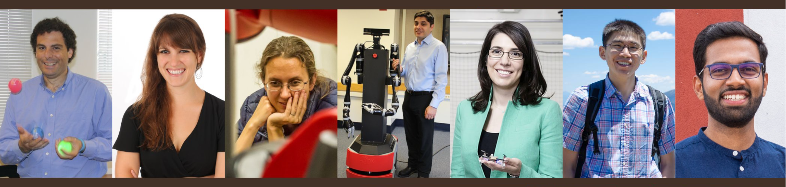

---
# Feel free to add content and custom Front Matter to this file.
# To modify the layout, see https://jekyllrb.com/docs/themes/#overriding-theme-defaults

permalink: /
title: Home
layout: all
---

Brown Robotics Talks consists of BigAI talks and lab talks ([CIT](https://www.google.com/maps/place/Department+of+Computer+Science/@41.826953,-71.4021589,17z/data=!3m1!4b1!4m6!3m5!1s0x89e4453b5275469d:0xc48a812b6cfb273!8m2!3d41.826953!4d-71.3995786!16s%2Fg%2F1hhwdn5zz?entry=ttu) 115). From spring 2024, this website is created to track both talk series. All confirmed schedule will be posted, together with recordings of past talks (you'll need a Brown account to access the recordings).

<h3>Schedule for Fall 2024</h3>

<table>
<thead>
  <tr>
    <th>Date</th>
    <th>Talk</th>
    <th>Speaker</th>
  </tr>
</thead>
<tbody>
  <tr>
    <td>10/11</td>
    <td><b>TBD</b></td>
    <td>Pulkit Verma</td>
  </tr>
  <tr>
    <td>10/18</td>
    <td><b>TBD</b></td>
    <td>Roberto Martin-Martin</td>
  </tr>
  <tr>
    <td>10/25</td>
    <td><b>TBD</b></td>
    <td>Alex LaGrass</td>
  </tr>
  <tr>
    <td>11/01</td>
    <td><b>TBD</b></td>
    <td>Jason Ma</td>
  </tr>
  <tr>
    <td>11/08</td>
    <td><b>TBD</b></td>
    <td>Neil Dantam</td>
  </tr>
  <tr>
    <td>11/15</td>
    <td><b>TBD</b></td>
    <td>Linfeng Zhao</td>
  </tr>
</tbody>
</table>

<h3>Spring 2024</h3>

<table>
<thead>
  <tr>
    <th>Date</th>
    <th>Talk</th>
    <th>Speaker</th>
  </tr>
</thead>
<tbody>
  <tr>
    <td>01/26</td>
    <td><b>Toward Full-Stack Reliable Robot Learning for Autonomy and Interaction</b> [<a href='assets/abstracts/glenchou.txt' target="_blank">abstract</a>][<a href='https://brown.hosted.panopto.com/Panopto/Pages/Viewer.aspx?id=f89a50f8-b208-4c16-9d03-b103012dbd92' target="_blank">recording</a>]</td>
    <td>Glen Chou</td>
  </tr>
  <tr>
    <td>02/02</td>
    <td><b>Deep Reinforcement Learning for Multi-Agent Interaction</b> [<a href='assets/abstracts/stefanoalbrecht.txt' target="_blank">abstract</a>][<a href='https://brown.hosted.panopto.com/Panopto/Pages/Viewer.aspx?id=a32a4d42-eac8-45a0-8ad3-b10a0135683e' target='_blank'>recording</a>]</td>
    <td>Stefano V. Albrecht</td>
  </tr>
  <tr>
    <td>02/09</td>
    <td><b>Object-level Planning: Bridging the Gap between Human Knowledge and Task and Motion Planning</b> [<a href='assets/abstracts/davidpaulius.txt' target="_blank">abstract</a>][<a href='https://brown.hosted.panopto.com/Panopto/Pages/Viewer.aspx?id=4d4d8cf2-965b-4f60-8c0e-b111013014d8' target='_blank'>recording</a>]</td>
    <td>David Paulius</td>
  </tr>  
  <tr>
    <td>03/01</td>
    <td><b>Towards Interactive Task and Motion Imitation</b> [<a href='assets/abstracts/felixwang.txt' target="_blank">abstract</a>][<a href='https://brown.hosted.panopto.com/Panopto/Pages/Viewer.aspx?id=08651f60-fdba-4160-952e-b1260133f8d1' target='_blank'>recording</a>]</td>
    <td>Felix Yanwei Wang</td>
  </tr>
  <tr>
    <td>03/08</td>
    <td><b>Towards Composable Scene Representations in Robotics and Vision</b> [<a href='assets/abstracts/ondrejbiza.txt' target="_blank">abstract</a>][<a href='https://brown.hosted.panopto.com/Panopto/Pages/Viewer.aspx?id=b0a1556d-bb90-4fca-a239-b12d0130a9bb' target='_blank'>recording</a>]</td>
    <td>Ondrej Biza</td>
  </tr>
  <tr>
    <td>04/19</td>
    <td><b>Building General-Purpose Robots with Integrated Learning and Planning</b> [<a href='assets/abstracts/jiayuanmao.txt' target="_blank">abstract</a>][<a href='https://brown.hosted.panopto.com/Panopto/Pages/Viewer.aspx?id=4f4fd531-a03d-4a13-9dbd-b15701264e37' target='_blank'>recording</a>]</td>
    <td>Jiayuan Mao</td>
  </tr>
  <tr>
    <td>04/26</td>
    <td><b>Experiment Planning with Function Approximation</b> [<a href='assets/abstracts/aldopacchiano.txt' target="_blank">abstract</a>]</td>
    <td>Aldo Pacchiano</td>
  </tr>
</tbody>
</table>